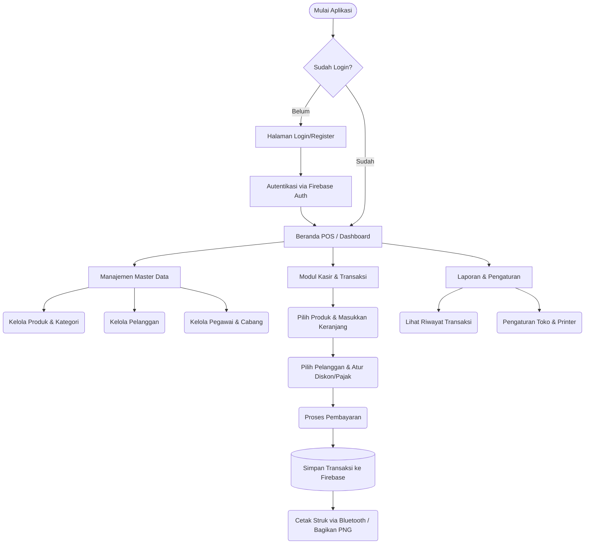
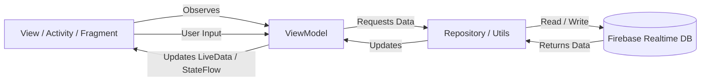

# 📦 RuangRupa POS (Aplikasi Penjualan)

Aplikasi **Point‑of‑Sale (POS)** modern untuk Android, dibangun dengan Kotlin, arsitektur MVVM, dan terintegrasi dengan **Firebase Authentication**, **Realtime Database**, serta **Firestore**. Menyediakan UI premium, pencetakan receipt lewat Bluetooth ESC/POS, serta berbagi receipt sebagai gambar.

---

## ✨ Fitur Utama
- **Autentikasi** menggunakan Firebase Auth (email & password).
- **Realtime Database** & **Firestore** untuk menyimpan data produk, kategori, transaksi, dll.
- **UI modern** dengan desain glassmorphism, dark mode, dan animasi mikro.
- **Filter kategori** dan pencarian produk.
- **Cetak receipt** via Bluetooth ESC/POS dengan logo aplikasi.
- **Bagikan receipt** sebagai PNG melalui intent.
- **Manajemen pegawai, cabang, dan laporan**.

---

## 🔄 Alur Kerja Aplikasi (Workflow)

Berikut adalah gambaran alur kerja utama (flowchart) dari RuangRupa POS:



---

## 🏗️ Arsitektur Sistem (MVVM)

Aplikasi ini menggunakan pola desain **Model-View-ViewModel (MVVM)** yang disarankan oleh Google. Pola ini memisahkan antarmuka pengguna dari logika bisnis dan data, sehingga kode lebih terstruktur dan mudah dipelihara.



---

## 📸 Tampilan Aplikasi

| **Login** | **Registrasi** | **Beranda POS** | **Kategori** | **Tambah Kategori** |
|:---:|:---:|:---:|:---:|:---:|
|  |  |  |  |  |
| **Produk** | **Tambah Produk** | **Pelanggan** | **Pegawai** | **Cabang** |
|  |  |  |  |  |
| **Transaksi** | **Laporan Penjualan** | **Pengaturan** | **Keranjang & Checkout** | **Nota** |
|  |  |  |  |  |
| **Printer** | **Profil** | | | |
|  |  | | | |

---

## 🗄️ Struktur Database (Firebase Realtime Database)

Aplikasi ini menggunakan struktur data hierarkis di Firebase Realtime Database. Data setiap pengguna (toko) diisolasi berdasarkan `uid` (User ID) dari Firebase Authentication.

```json
{
  "users": {
    "UID_PENGGUNA": {
      "produk": {
        "id_produk": {
          "id": "String",
          "name": "String",
          "category": "String",
          "stock": "Int",
          "buyPrice": "Double",
          "sellPrice": "Double"
        }
      },
      "kategori": {
        "id_kategori": {
          "idKategori": "String",
          "namaKategori": "String",
          "statusKategori": "String"
        }
      },
      "pelanggan": {
        "id_pelanggan": {
          "idPelanggan": "String",
          "namaPelanggan": "String",
          "noHp": "String",
          "alamat": "String",
          "email": "String",
          "totalTransaksi": "Int",
          "totalBelanja": "Double"
        }
      },
      "pegawai": {
        "id_pegawai": {
          "idPegawai": "String",
          "namaPegawai": "String",
          "jabatan": "String",
          "noHp": "String",
          "statusPegawai": "String"
        }
      },
      "cabang": {
        "id_cabang": {
          "idCabang": "String",
          "namaCabang": "String",
          "alamat": "String",
          "noTelp": "String",
          "statusCabang": "String"
        }
      },
      "transaksi": {
        "id_transaksi": {
          "idTransaksi": "String",
          "nomorNota": "String",
          "items": {
            "id_item": {
              "idProduk": "String",
              "namaProduk": "String",
              "kategori": "String",
              "hargaSatuan": "Double",
              "jumlah": "Int",
              "subtotal": "Double"
            }
          },
          "subtotal": "Double",
          "diskon": "Double",
          "pajak": "Double",
          "totalHarga": "Double",
          "metodePembayaran": "String",
          "jumlahBayar": "Double",
          "kembalian": "Double",
          "idPelanggan": "String",
          "namaPelanggan": "String",
          "kasir": "String",
          "tanggal": "String",
          "waktu": "String",
          "timestamp": "Long",
          "status": "String"
        }
      }
    }
  }
}
```

---

## 🛠️ Instalasi & Setup
1. **Clone repository**
   ```bash
   git clone https://github.com/cimengabu/penjualan.git
   cd penjualan
   ```
2. **Buka di Android Studio** (Flamingo atau lebih baru).
3. **Sinkronisasi Gradle** → "Sync Now".
4. **Firebase**
   - Download `google-services.json` dari Firebase Console dan letakkan di folder `app/`.
   - Aktifkan **Authentication** (Email/Password) dan **Realtime Database** serta **Cloud Firestore**.
   - Pastikan node berikut ada di Realtime Database (untuk data cadangan): `users`, `produk`, `kategori`, `pelanggan`, `transaksi`.
5. **Run aplikasi**
   ```bash
   ./gradlew assembleDebug   # atau gunakan tombol Run di Android Studio
   ```

---

## 🚀 Cara Pakai
1. **Login** menggunakan email & password yang telah terdaftar.
2. Pilih **kategori** di bagian atas untuk memfilter produk.
3. Tambahkan produk ke keranjang dengan mengetuknya.
4. Pilih **pelanggan** (opsional) dan tekan **Pembayaran**.
5. Pada layar receipt, tekan **Bagikan** untuk kirim PNG atau **Cetak** untuk mencetak lewat printer Bluetooth.

---

## 🤝 Kontribusi
1. Fork repository ini.
2. Buat branch fitur (`git checkout -b fitur/fitur-baru`).
3. Lakukan perubahan, pastikan kode mengikuti style proyek.
4. Buat Pull Request dengan deskripsi yang jelas.

---

## 📄 Lisensi
Proyek ini dilisensikan di bawah **MIT License** – lihat file `LICENSE` untuk detail lengkap.

---

*Selamat mencoba RuangRupa POS! Jika ada pertanyaan atau ingin menambahkan fitur, silakan buat issue atau hubungi saya.*
