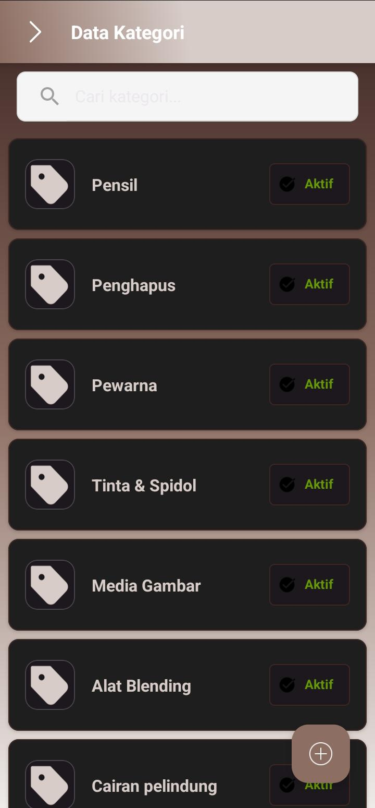
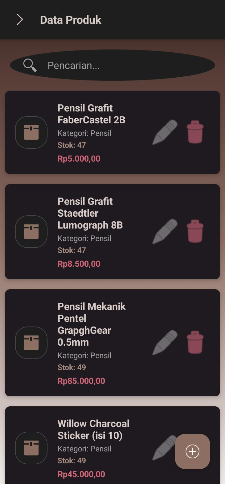
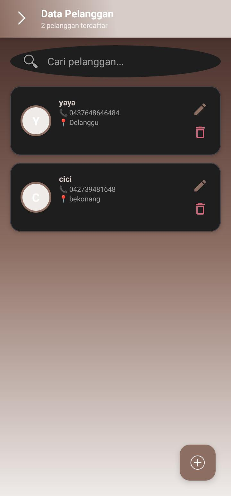
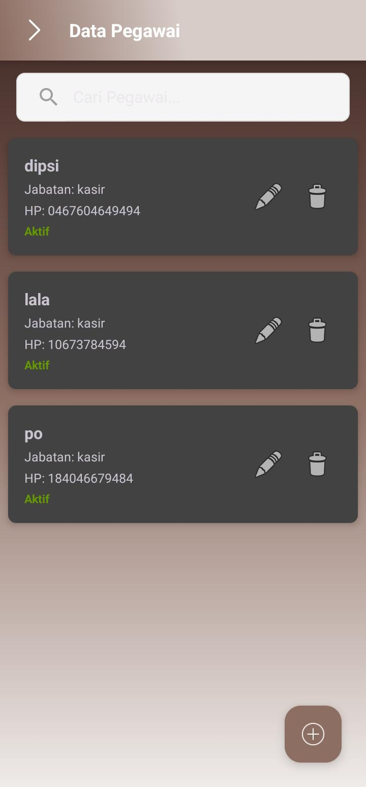
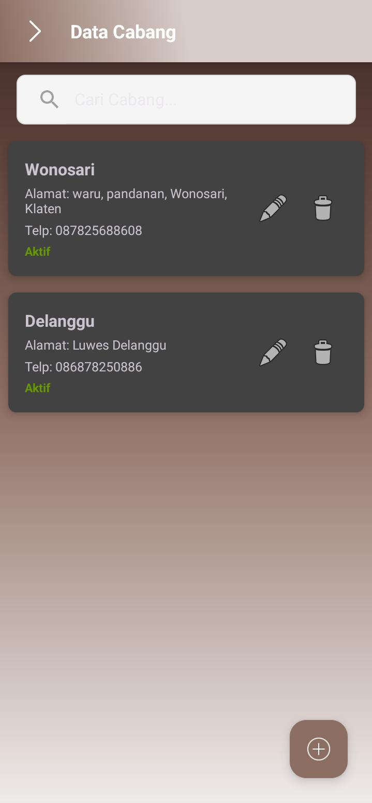
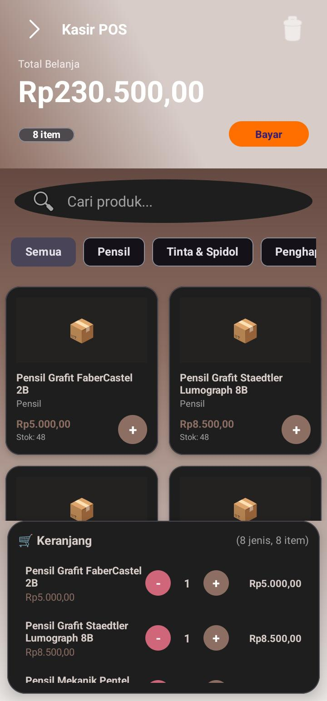
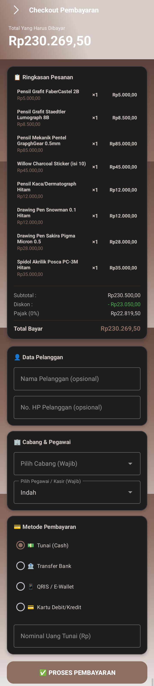
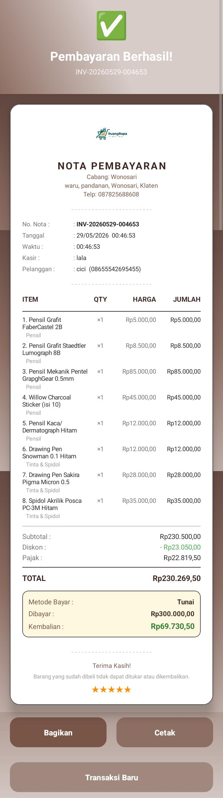
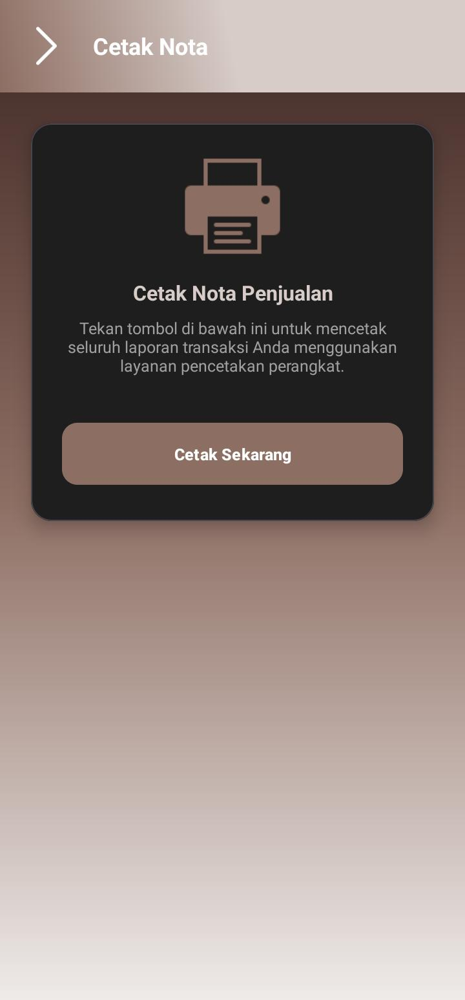
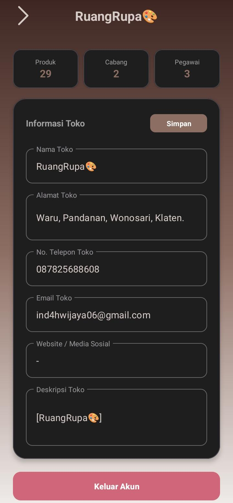

# 📦 RuangRupa POS (Aplikasi Penjualan)

Aplikasi **Point‑of‑Sale (POS)** modern untuk Android, dibangun dengan Kotlin, arsitektur MVVM, dan terintegrasi dengan **Firebase Authentication**, **Realtime Database**, serta **Firestore**. Menyediakan UI premium, pencetakan receipt lewat Bluetooth ESC/POS, serta berbagi receipt sebagai gambar.

---

## ✨ Fitur Utama
- **Autentikasi** menggunakan Firebase Auth (email & password).
- **Realtime Database** & **Firestore** untuk menyimpan data produk, kategori, transaksi, dll.
- **UI modern** dengan desain glassmorphism, dark mode, dan animasi mikro.
- **Filter kategori** dan pencarian produk.
- **Cetak receipt** via Bluetooth ESC/POS dengan logo aplikasi.
- **Bagikan receipt** sebagai PNG melalui intent.
- **Manajemen pegawai, cabang, dan laporan**.

---

## 📸 Tampilan Aplikasi
| Halaman | Gambar |
| ------- | ------ |
| **Login** |  |
| **Registrasi** |  |
| **Beranda POS** |  |
| **Kategori** |  |
| **Tambah Kategori** |  |
| **Produk** |  |
| **Tambah Produk** |  |
| **Pelanggan** |  |
| **Pegawai** |  |
| **Cabang** |  |
| **Transaksi** |  |
| **Laporan Penjualan** |  |
| **Pengaturan** |  |
| **Keranjang & Checkout** |  |
| **Nota** |  |
| **Printer** |  |
| **Profil** |  |

---

## 🛠️ Instalasi & Setup
1. **Clone repository**
   ```bash
   git clone https://github.com/cimengabu/penjualan.git
   cd penjualan
   ```
2. **Buka di Android Studio** (Flamingo atau lebih baru).
3. **Sinkronisasi Gradle** → "Sync Now".
4. **Firebase**
   - Download `google-services.json` dari Firebase Console dan letakkan di folder `app/`.
   - Aktifkan **Authentication** (Email/Password) dan **Realtime Database** serta **Cloud Firestore**.
   - Pastikan node berikut ada di Realtime Database (untuk data cadangan): `users`, `produk`, `kategori`, `pelanggan`, `transaksi`.
5. **Run aplikasi**
   ```bash
   ./gradlew assembleDebug   # atau gunakan tombol Run di Android Studio
   ```

---

## 🚀 Cara Pakai
1. **Login** menggunakan email & password yang telah terdaftar.
2. Pilih **kategori** di bagian atas untuk memfilter produk.
3. Tambahkan produk ke keranjang dengan mengetuknya.
4. Pilih **pelanggan** (opsional) dan tekan **Pembayaran**.
5. Pada layar receipt, tekan **Bagikan** untuk kirim PNG atau **Cetak** untuk mencetak lewat printer Bluetooth.

---

## 🤝 Kontribusi
1. Fork repository ini.
2. Buat branch fitur (`git checkout -b fitur/fitur-baru`).
3. Lakukan perubahan, pastikan kode mengikuti style proyek.
4. Buat Pull Request dengan deskripsi yang jelas.

---

## 📄 Lisensi
Proyek ini dilisensikan di bawah **MIT License** – lihat file `LICENSE` untuk detail lengkap.

---

*Selamat mencoba RuangRupa POS! Jika ada pertanyaan atau ingin menambahkan fitur, silakan buat issue atau hubungi saya.*
