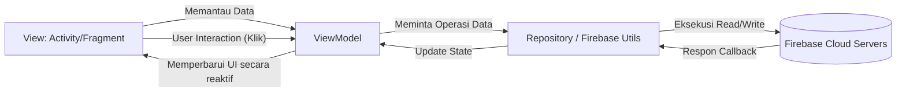

<div align="center">
  <h1>📦 RuangRupa POS (Aplikasi Penjualan UMKM)</h1>
  <p>Aplikasi <b>Point-of-Sale (POS)</b> super modern berbasis Android untuk memudahkan pengelolaan toko, stok, dan kasir.</p>

  [](#)
  [](#)
  [](#)
  [](#)
</div>

---

## 📖 Deskripsi Proyek
**RuangRupa POS** adalah aplikasi kasir pintar yang dirancang khusus untuk mempermudah operasional Usaha Mikro, Kecil, dan Menengah (UMKM) maupun ritel modern. Aplikasi ini dibangun secara _native_ untuk OS Android menggunakan bahasa pemrograman **Kotlin** dengan pola arsitektur **MVVM (Model-View-ViewModel)**. 

Didukung oleh infrastruktur cloud dari **Google Firebase**, aplikasi ini menjamin keamanan data, sinkronisasi *real-time* antar perangkat toko, dan kecepatan akses tingkat tinggi. Tidak hanya mencatat penjualan, aplikasi ini juga terintegrasi langsung dengan **Printer Thermal Bluetooth (ESC/POS)** untuk pencetakan struk instan, dan memiliki fitur membagikan (share) struk digital berformat gambar/PNG ke pelanggan.

---

## ✨ Fitur Unggulan Secara Detail

1. 🔐 **Autentikasi & Keamanan (Firebase Auth)**
   Setiap pemilik toko/cabang diwajibkan melakukan *login* dengan email dan password. Sistem keamanan dienkripsi langsung oleh Google Firebase.
2. ☁️ **Cloud Database Terisolasi (Realtime Database)**
   Setiap akun (toko) memiliki ruang data yang 100% terisolasi berdasarkan UID (User ID). Data produk dari Toko A tidak akan pernah bercampur dengan Toko B. Semuanya tersimpan di cloud dan tidak akan hilang meskipun *device* rusak atau hilang.
3. 🎨 **UI/UX Premium (Glassmorphism & Dark Mode)**
   Desain antarmuka dibuat senyaman mungkin untuk penggunaan berjam-jam. Mengusung konsep *Glassmorphism*, dukungan mode gelap (*Dark Mode*), dan *micro-animations* yang sangat responsif.
4. 🛒 **Modul Kasir Cepat (Point of Sale)**
   Sistem keranjang belanja (*cart*) yang cepat. Kasir dapat memilih produk, menambah/mengurangi *quantity*, menerapkan diskon/pajak, dan langsung menghitung kembalian secara presisi.
5. 🖨️ **Integrasi Hardware (Printer Bluetooth ESC/POS)**
   Struk fisik langsung bisa dicetak menggunakan mini printer bluetooth thermal dengan logo kustom (jika printer mendukung cetak *bitmap*), membuat toko terlihat lebih profesional.
6. 📱 **Nota Digital (Share to WhatsApp/Social Media)**
   Tidak ada kertas? Tidak masalah. Nota bisa dikonversi secara otomatis menjadi gambar (PNG) dan dikirim langsung ke WhatsApp pelanggan.
7. 👥 **Manajemen Data Master yang Komprehensif**
   Terdapat modul khusus untuk mengelola: **Produk**, **Kategori**, **Pelanggan**, **Pegawai**, dan **Cabang**.
8. 📊 **Laporan & Riwayat Penjualan**
   Fitur rekapan total transaksi harian beserta rincian (*items*) tiap pembelian yang tercatat secara permanen dengan *timestamp*.

---

## 🛠️ Teknologi yang Digunakan (Tech Stack)

Aplikasi ini menggunakan perpaduan teknologi paling *up-to-date* dalam pengembangan Android modern:

- **Bahasa Pemrograman**: Kotlin
- **Arsitektur**: MVVM (Model-View-ViewModel)
- **UI & Layouting**: XML dengan Material Design 3 Components, ViewBinding
- **Backend / Database**:
  - Firebase Authentication (Email/Password)
  - Firebase Realtime Database (Struktur JSON)
  - Firebase Firestore (Opsional untuk data terstruktur)
- **Asynchronous / Concurrency**: Kotlin Coroutines & Flow
- **Hardware Integrations**: Bluetooth Socket API (ESC/POS Printer Command)

---

## 🔄 Alur Kerja Aplikasi (Workflow)

Untuk memahami bagaimana seluruh komponen saling berinteraksi, berikut adalah alur kerja operasional dari aplikasi RuangRupa POS:

```mermaid
graph TD
    A([Mulai Aplikasi / Splash Screen]) --> B{Sesi Aktif? (Sudah Login)}
    B -- Belum --> C[Halaman Login & Registrasi]
    C --> D[Verifikasi via Firebase Auth]
    D --> E[Beranda POS (Dashboard Master)]
    B -- Sudah --> E
    
    E --> F[Modul Manajemen Data]
    F --> F1(Tambah/Edit Produk)
    F --> F2(Manajemen Kategori & Filter)
    F --> F3(Buku Kontak Pelanggan)
    F --> F4(Data Pegawai & Cabang)
    
    E --> G[Modul Utama: Kasir]
    G --> G1(Tap Produk & Masukkan ke Keranjang)
    G1 --> G2(Checkout: Pilih Pelanggan, Diskon & Pajak)
    G2 --> G3(Proses Pembayaran: Input Uang Tunai)
    G3 --> G4[(Transaksi Tersimpan ke Firebase)]
    G4 --> G5(Cetak Struk Bluetooth Fisik)
    G4 --> G6(Bagikan Struk Digital Berupa Gambar)
    
    E --> H[Laporan & Rekapitulasi]
    H --> H1(Lihat Riwayat Seluruh Transaksi)
    H --> H2(Pengaturan Toko & Koneksi Printer)
```

---

## 🏗️ Arsitektur Sistem (MVVM Pattern)

Google merekomendasikan penggunaan **MVVM (Model-View-ViewModel)** agar antarmuka (UI) tidak bercampur dengan logika pengambilan data. Dengan arsitektur ini, performa aplikasi lebih stabil dan minim *bug* / *Force Close*.



- **View**: Bertanggung jawab menampilkan data ke layar dan menangkap klik *user* (Activity/Fragment).
- **ViewModel**: Menyimpan *state* antarmuka, memastikan data tidak hilang saat layar diputar (*screen rotation*).
- **Repository**: Jembatan tunggal yang bertugas mengambil dan memformat data mentah dari Firebase.

---

## 📸 Tampilan Antarmuka Aplikasi (UI Showcase)

Berikut adalah bukti visual dari kualitas desain *front-end* aplikasi ini:

| **Login** | **Registrasi** | **Beranda POS** | **Kategori** | **Tambah Kategori** |
|:---:|:---:|:---:|:---:|:---:|
|  |  |  |  |  |
| **Produk** | **Tambah Produk** | **Pelanggan** | **Pegawai** | **Cabang** |
|  |  |  |  |  |
| **Transaksi** | **Laporan Penjualan** | **Pengaturan** | **Keranjang & Checkout** | **Nota** |
|  |  |  |  |  |
| **Printer** | **Profil** | | | |
|  |  | | | |

---

## 🗄️ Skema Database (Firebase Realtime Database)

Penyimpanan data sama sekali tidak mengandalkan database lokal yang rawan hilang. Aplikasi menggunakan *NoSQL JSON tree* di Firebase.
Setiap *node* dikunci dan diisolasi berdasarkan **UID (User ID)** pemilik toko demi menjaga kerahasiaan (*Privacy & Security*).

```json
{
  "users": {
    "UID_FIREBASE_PENGGUNA": {
      "produk": {
        "id_produk_unik": {
          "id": "String",
          "name": "String",
          "category": "String",
          "stock": "Int",
          "buyPrice": "Double",
          "sellPrice": "Double"
        }
      },
      "kategori": {
        "id_kategori_unik": {
          "idKategori": "String",
          "namaKategori": "String",
          "statusKategori": "String"
        }
      },
      "pelanggan": {
        "id_pelanggan_unik": {
          "idPelanggan": "String",
          "namaPelanggan": "String",
          "noHp": "String",
          "alamat": "String",
          "email": "String",
          "totalTransaksi": "Int",
          "totalBelanja": "Double"
        }
      },
      "pegawai": {
        "id_pegawai_unik": {
          "idPegawai": "String",
          "namaPegawai": "String",
          "jabatan": "String",
          "noHp": "String",
          "statusPegawai": "String"
        }
      },
      "cabang": {
        "id_cabang_unik": {
          "idCabang": "String",
          "namaCabang": "String",
          "alamat": "String",
          "noTelp": "String",
          "statusCabang": "String"
        }
      },
      "transaksi": {
        "id_transaksi_unik": {
          "idTransaksi": "String",
          "nomorNota": "String (Auto Generated)",
          "items": {
            "id_item_unik": {
              "idProduk": "String",
              "namaProduk": "String",
              "kategori": "String",
              "hargaSatuan": "Double",
              "jumlah": "Int",
              "subtotal": "Double"
            }
          },
          "subtotal": "Double",
          "diskon": "Double",
          "pajak": "Double",
          "totalHarga": "Double",
          "metodePembayaran": "String (Tunai/Non-Tunai)",
          "jumlahBayar": "Double",
          "kembalian": "Double",
          "idPelanggan": "String",
          "namaPelanggan": "String",
          "kasir": "String",
          "tanggal": "String (DD-MM-YYYY)",
          "waktu": "String (HH:mm:ss)",
          "timestamp": "Long (Unix Time)",
          "status": "String (Selesai/Batal)"
        }
      }
    }
  }
}
```

---

## ⚙️ Panduan Instalasi & Persiapan (Setup)

Bagi pengembang (atau guru penguji) yang ingin me-*running* dan meninjau source code secara mandiri, ikuti langkah berikut:

### 1. Kloning Source Code
Buka terminal/Command Prompt dan ketikkan perintah berikut untuk mengunduh source code secara lengkap:
```bash
git clone https://github.com/cimengabu/penjualan.git
cd penjualan
```

### 2. Membuka Project
- Buka **Android Studio** (Disarankan versi *Flamingo* ke atas).
- Pilih menu **Open** dan arahkan ke folder `penjualan` yang baru saja di-*clone*.
- Tunggu hingga proses **Gradle Sync** selesai secara otomatis.

### 3. Konfigurasi Server Firebase
Aplikasi ini bergantung pada Firebase, maka konfigurasi kunci (*google-services.json*) wajib ada:
1. Pergi ke [Firebase Console](https://console.firebase.google.com/).
2. Buat sebuah *Project* baru.
3. Daftarkan aplikasi Android (dengan *package name*: `com.example.penjualan`).
4. Unduh file `google-services.json`.
5. *Copy-Paste* file tersebut ke dalam folder `app/` di dalam project Android Studio Anda.
6. Aktifkan **Authentication**, pilih provider **Email/Password**.
7. Aktifkan **Realtime Database**. *Set* *Rules* databasenya menjadi `true` sementara untuk tahap *testing*.

### 4. Menjalankan Aplikasi (*Running*)
Gunakan perangkat Android fisik dengan kabel USB (disarankan untuk mencoba fitur Bluetooth) atau gunakan Emulator.
Lalu klik tombol **Run 'app' (Shift+F10)** di Android Studio.

---

## ❓ Frequently Asked Questions (FAQ)

> **Q: Mengapa tidak menggunakan SQLite atau Room Database lokal?**  
> **A:** Agar data penjualan aman. Jika *device* kasir hilang atau rusak, seluruh data otomatis kembali ketika pengguna melakukan *Login* di *device* baru berkat Firebase Cloud.

> **Q: Bagaimana mekanisme keamanan datanya?**  
> **A:** Struktur database pada Firebase kami lindungi dengan menggunakan node *UID*. Seseorang tidak dapat membaca/menulis data milik UID orang lain. Autentikasi sepenuhnya dienkripsi oleh server Google.

> **Q: Apakah nota transaksi bisa tersimpan di galeri?**  
> **A:** Ya. Aplikasi menggunakan fitur *View to Bitmap* untuk melakukan proses perenderan layout kasir secara transparan dan menyimpannya sebagai file PNG ke *storage* eksternal sebelum dibagikan ke media sosial.

---

## 🤝 Pedoman Kontribusi (Contributing)

Jika Anda ingin ikut berkontribusi mengembangkan aplikasi POS ini:
1. Lakukan *Fork* pada repositori ini.
2. Buat *branch* khusus fitur Anda (`git checkout -b fitur/nama-fitur-keren-anda`).
3. Tulis kode dengan rapi dan ikuti *Clean Code principles*.
4. *Push* kode ke *branch* Anda (`git push origin fitur/nama-fitur-keren-anda`).
5. Ajukan **Pull Request (PR)** dengan melampirkan *screenshot* perubahan.

---

## 📄 Lisensi (License)

Dikembangkan sepenuhnya oleh **cimengabu**.  
Proyek ini bersifat *Open Source* dan dilindungi di bawah **MIT License**. Anda bebas menggunakan, memodifikasi, dan mendistribusikan aplikasi ini dengan syarat mencantumkan kredit kepada pengembang asli.

---
*Dikembangkan dengan ☕ dan dedikasi tinggi. Sukses selalu untuk pengembangan sistem UMKM di Indonesia!*
